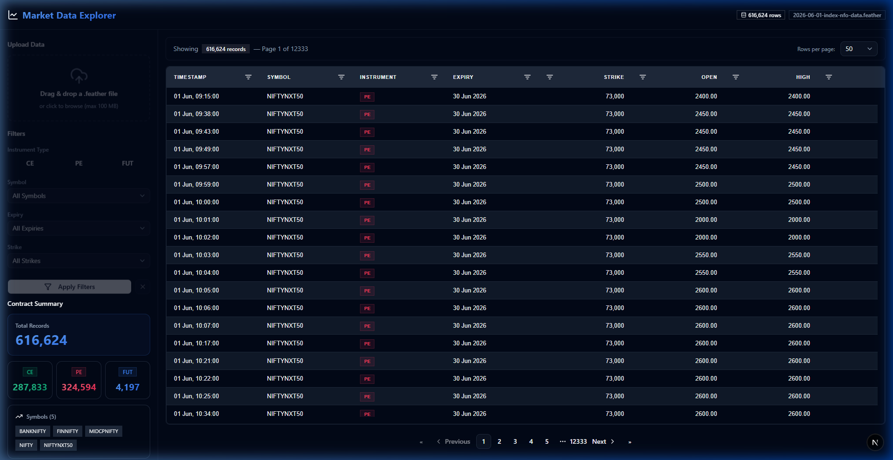
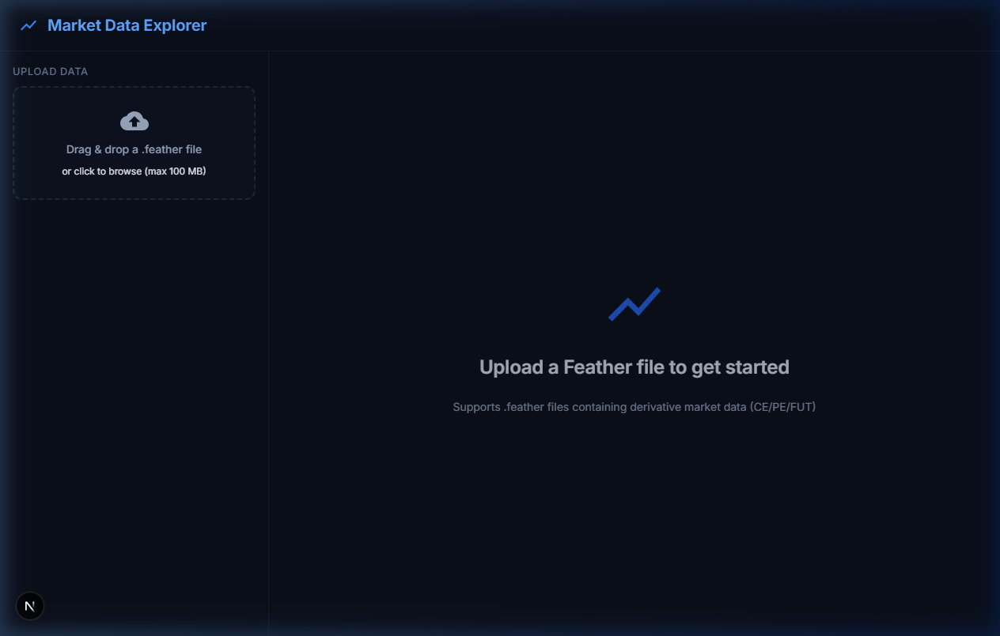

# Market Data Explorer

A full-stack web application for uploading and interactively exploring derivative market data (Feather files). Filter by instrument type (CE/PE/FUT), expiry, strike, and symbol — with a premium dark trading terminal UI.

## Architecture

```
┌─────────────────────────┐
│   Next.js Frontend      │  :3000
│   (TypeScript +         │
│    Tailwind + Shadcn UI │
│    + AG Grid)           │
└───────────┬─────────────┘
            │ HTTP
            ▼
┌─────────────────────────┐
│   Bun API Gateway       │  :4000
│   (Express + TypeScript)│
└───────────┬─────────────┘
            │ HTTP
            ▼
┌─────────────────────────┐
│   Python FastAPI Service │  :8000
│   (Pandas + PyArrow)    │
└───────────┬─────────────┘
            │
            ▼
       .feather file
```

## Tech Stack

| Layer         | Technology                                     |
|---------------|------------------------------------------------|
| Frontend      | Next.js 16, React 19, TypeScript, Tailwind CSS, Shadcn UI, AG Grid Community |
| API Gateway   | Bun, Express 5, TypeScript                     |
| Data Service  | Python 3.13, FastAPI, Pandas, PyArrow          |
| Containerization | Docker, Docker Compose                      |

## Setup Instructions

### Prerequisites

- **Bun** ≥ 1.0 — [Install Bun](https://bun.sh)
- **Python** ≥ 3.11
- **Node.js** ≥ 18 (used by Next.js)
- **Docker** & **Docker Compose** (optional, for containerized deployment)

### Local Development

#### 1. Python Service

```bash
cd python-service
pip install -r requirements.txt
uvicorn main:app --host 0.0.0.0 --port 8000 --reload
```

#### 2. Bun API Gateway

```bash
cd backend
bun install
bun run dev
```

#### 3. Next.js Frontend

```bash
cd frontend
bun install
bun run dev
```

The app will be available at **http://localhost:3000**.

### Docker Deployment

```bash
docker-compose up --build
```

This starts all three services:
- Frontend: http://localhost:3000
- API Gateway: http://localhost:4000
- Python Service: http://localhost:8000

## API Endpoints

### Upload File
```
POST /api/upload
Content-Type: multipart/form-data

Response: { "rows": 152345, "columns": [...], "filename": "..." }
```

### Get Metadata
```
GET /api/metadata

Response: {
  "instruments": ["CE", "PE", "FUT"],
  "names": ["NIFTY", "BANKNIFTY", ...],
  "expiries": [...],
  "expiries_by_instrument": { "CE": [...], "PE": [...], "FUT": [...] },
  "strikes": [...],
  "strikes_by_instrument": { ... },
  "contract_counts": { "CE": 1234, "PE": 5678, "FUT": 90 },
  "total_rows": 616624
}
```

### Filter Data
```
POST /api/filter
Content-Type: application/json

Request: {
  "instrument": "CE",
  "expiry": "2026-06-26",
  "strike": 25000,
  "name": "NIFTY",
  "page": 1,
  "page_size": 50,
  "sort_by": "date",
  "sort_order": "asc"
}

Response: { "data": [...], "total": 100, "page": 1, "page_size": 50, "total_pages": 2 }
```

### Preview Data
```
GET /api/preview?page=1&page_size=50&sort_by=date&sort_order=asc&search=NIFTY

Response: { "data": [...], "total": 616624, "page": 1, "page_size": 50, "total_pages": 12333 }
```

## Assumptions

1. **Single file at a time**: The application handles one uploaded Feather file at a time. Uploading a new file replaces the previous one.

2. **Instrument-specific expiries**: FUT, CE, and PE contracts have **different expiry dates**. The filter panel dynamically updates available expiries based on the selected instrument type.

3. **FUT strike = 0**: Futures contracts have a strike price of 0.0, which is meaningless. The strike filter is hidden when FUT is selected.

4. **Dataset columns**: The application expects the following columns in the Feather file:
   - `date`, `open`, `high`, `low`, `close`, `volume`, `oi`
   - `symbol`, `name`, `expiry`, `strike`, `instrument_type`

5. **In-memory processing**: Data is loaded into memory (Pandas DataFrame) for fast filtering. This works well for typical daily files (~15-20 MB, ~600K rows) but may need server-side pagination for very large files.

6. **Client timezone**: Timestamps are displayed in Indian Standard Time (IST, UTC+5:30) matching the market data source.

7. **File size limit**: Maximum upload size is 100 MB.

## Project Structure

```
market_data_explorer/
├── frontend/              # Next.js + TypeScript + MUI + AG Grid
│   ├── src/
│   │   ├── app/           # Next.js App Router pages
│   │   ├── components/    # React components
│   │   ├── lib/           # API client, theme
│   │   └── types/         # TypeScript interfaces
│   ├── package.json
│   └── Dockerfile
├── backend/               # Bun + Express API Gateway
│   ├── src/
│   │   └── server.ts
│   ├── package.json
│   ├── tsconfig.json
│   └── Dockerfile
├── python-service/        # FastAPI + Pandas data service
│   ├── main.py
│   ├── test_main.py
│   ├── requirements.txt
│   └── Dockerfile
├── docker-compose.yml
└── README.md
```

## Running Tests

```bash
# Python service
cd python-service
pip install pytest httpx
pytest test_main.py -v

# Bun gateway
cd backend
bun test
```

## What This Project Demonstrates

- **Data Handling**: Efficient Feather file I/O with Pandas/PyArrow
- **React Fundamentals**: Component composition, state management, typed props
- **File Upload Workflows**: Drag-and-drop, validation, progress tracking
- **Financial Data Understanding**: Instrument-specific filtering (CE/PE/FUT expiries differ)
- **Code Organization**: Clean separation of concerns across three services
- **Modern UI/UX**: Dark theme, glassmorphism, micro-animations, responsive layout

## Screenshots

### Main Dashboard & Charting


### Clean UI & Tables

